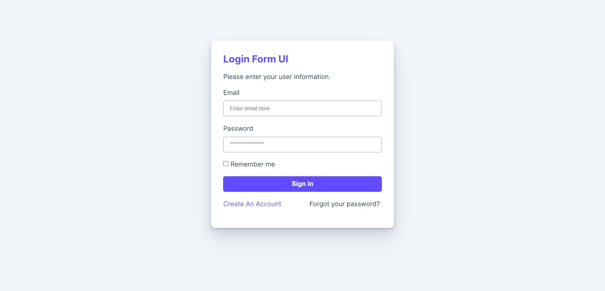

# Exercises of week 02

- [x] KHÔNG SỬ DỤNG FLEX BOX
- [x] KHÔNG SỬ DỤNG GRID
- [x] KHÔNG SỬ DỤNG POSITION
- [x] CHỈ SỬ DỤNG MARGIN, PADDING, TEXT-ALIGN VÀ KIẾN THỨC VỀ INLINE ELEMENT, BLOCK ELEMENT

## 1. Ex1

- Link ảnh: [Google Drive](https://drive.google.com/file/d/18BvH2bsnGVgsc-sY29mc3c1p43PdHAdM/view?usp=share_link)
- Link tải font: [VNM Sans Display Regular](https://drive.google.com/file/d/1LHthSn2uOLV5B8SfNTo8MtPJ6nK5UCJZ/view?usp=share_link)
- Màu nền: #0313b0
- Màu chữ: #ffffff

## 2. Ex2

- Link ảnh: [Google Drive](https://drive.google.com/file/d/1Vec989o8qIQ4rFRqjt6nPmvLb3VunSZk/view?usp=share_link)
- Link Google Font: [Inter](https://fonts.google.com/specimen/Inter)
- Màu chủ đạo: #624bff
- Màu nền: #f1f5f9
- Màu chữ: #212b36
