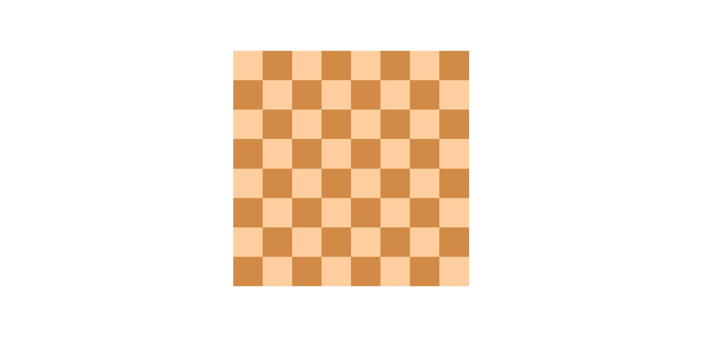
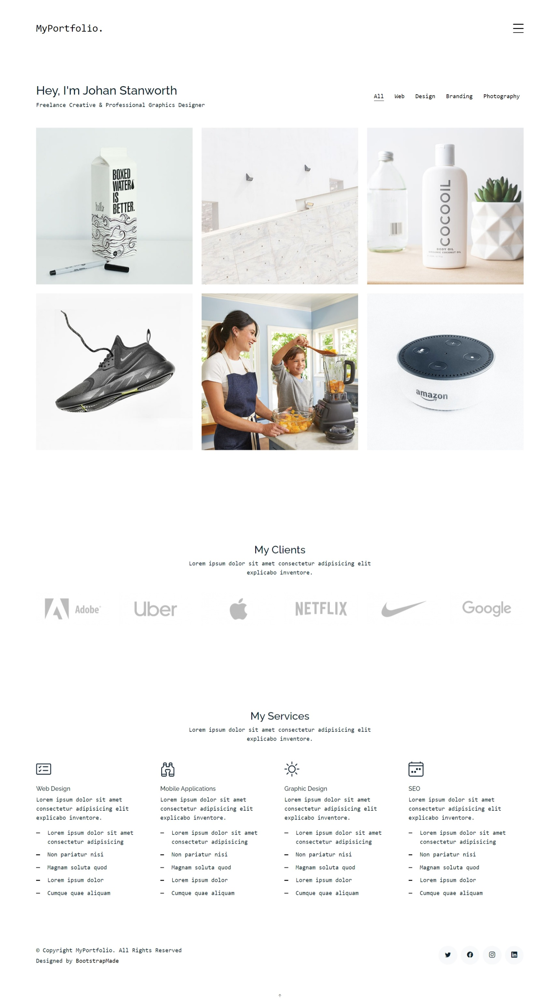

# Exercises of week 03

**Sử dụng HTML và CSS để tạo giao diện theo đúng bố cục trong ảnh, có thể thay đổi nội dung văn bản.**

- [x] KHÔNG SỬ DỤNG GRID
- [x] KHÔNG SỬ DỤNG POSITION
- [x] SỬ DỤNG CSS SELECTOR, FLEXOX VÀ BOX MODEL

## 1. Ex1

- Link ảnh: <a href="https://drive.google.com/file/d/1baxHTDrQ0r0RdNMrWuzwobneYPcEYBvw/view?usp=sharing" target="_blank">Google Drive</a>
- Màu chữ: orange

## 2. Ex2

- Link ảnh: <a href="https://drive.google.com/file/d/1FmOhUD4FLjVd1g1QQQCqkvawSYHg-Mzj/view?usp=sharing" target="_blank">Google Drive</a>
- Mã màu: #ffce9e, #d18b47

## 3. Ex3

- Link đề bài: <a href="https://drive.google.com/file/d/1tQalVcejlROTH7lZwYdtNAjd7zOqgtXQ/view?usp=sharing" target="_blank">Google Drive</a>
- Link Google Font: <a href="https://fonts.google.com/specimen/Inconsolata" target="_blank">Inconsolata</a>
- Link Google Font: <a href="https://fonts.google.com/specimen/Raleway" target="_blank">Raleway</a>
- List ảnh:
  - 
  - 
  - 
  - 
  - 
  - 
- Logo:
  - 
  - 
  - 
  - 
  - 
  - 
