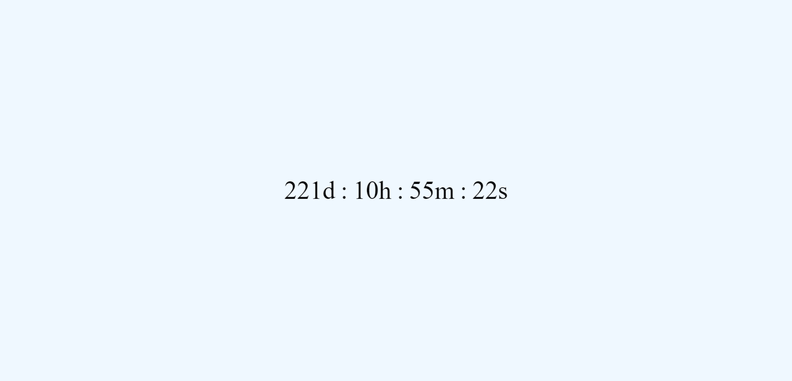

# Exercise Week 12: Number, Date, Time and DOM

#### 1. Login Form

- Cho code HTML và CSS form đăng nhập: [Link Code](./LoginForm/)
- Hãy dùng ngôn ngữ Javascript để lấy ra thông tin đăng nhập khi click vào button hoặc submit form (in ra cửa sổ console trên trình duyệt)

#### 2. Countdown

Sử dụng HTML và Javascript (Number, Date, Time và DOM) để tạo 1 giao diện website countdown thời gian hiện tại đến sinh nhật của Câu Lạc Bộ Tin Học HIT

#### 3. Change Active Menu Item on Page Scroll

**Bài tập tự luyện không bắt buộc**
Dựa vào code HTML và CSS [(Link Code)](https://github.com/phuonghight/HIT14_Web_Private/tree/master/Week-12-Number-Date-Time-DOM) của week 12, hãy thêm mã javascript để khi lăn chuột thì menu item được active tương ứng với phần đang được hiển thị
